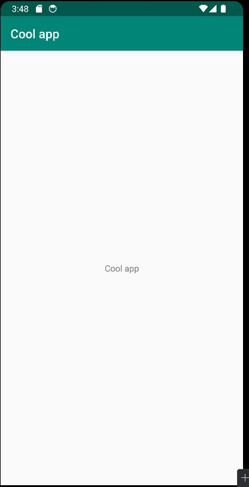

# Rapport

Startade med att skapa ett konto på Github med samma användarnamn som på högskolan i Skövdes system.  
Sedan forkades repositoryn som fanns tillgänglig för uppgiften och android studio laddades ned.  
Därefter kopierades repositoryn till datorn genom android studio.  
Då det jobbades på egen dator behövde det ändras till rätt java version i android studio, samt gå in i bios och "enabla" virtualisering för att amd tydligen krävde det.  
För att göra klart uppgiften öppnades filen strings.xml och värdet på stringen app_name ändrades till "Cool app", och tillslut commitade och pushades projektet.  

### Kod
```
<resources>
    <string name="app_name">Cool app</string>
</resources>
```

### Bild

